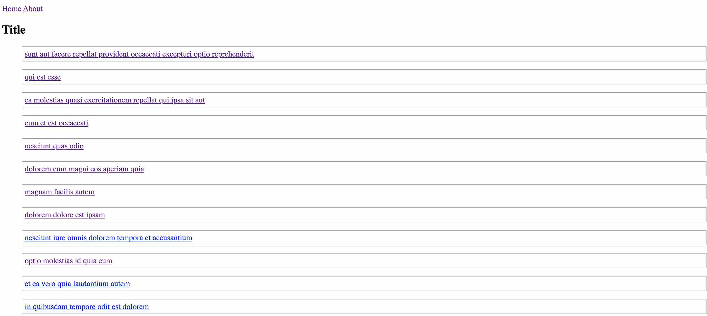

### learn fetch API
1\. Learning method fetch api in component and with storage 

For Fetch api at component for detail data but using fetch api with store is main of API.
### Slot

To learn using slot

### svelte-routing

This a lesson learnig about svelte-routing wihout sveltkit.
[npmjs](https://www.npmjs.com/package/svelte-routing) and [github svelte-routing](https://github.com/EmilTholin/svelte-routing/blob/master/CHANGELOG.md)

----

